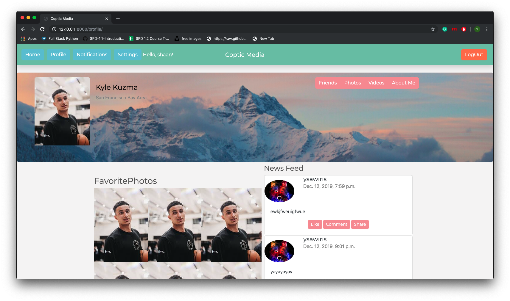

UPDATES: 

- Users can now upload a Profile Picture.
- Fixed issue where you can select who posted the post. Now each post is assigned to the user who is logged in. 
- When a user is created a profile is automatically created. 
- Fixed the collaspe navbar, its now working!

Welcome to Coptic Media 

Visit Us @ http://copticmedia.herokuapp.com/

Our goal is to be an open source social media website that helps communities connect. Yes we know Facebook exists, but this will be application will be partly owned by the communities who use it so they will also reap from the profits that are made. 

Currently we are only running the application for the Coptic community. We do appreciate your patience. 

Here are some of jourenys some users had!

James is looking for a youth meeting this Friday night. He remembered that the church he usually attends has canceled this weeks meeting due to construction. He was wondering how he can find another local church and see if they have a meeting this week. He googled Coptic church, and found coptic media. He was able to see that there was a church near him, but he need to sign up to see the church calendar. James signed up and was able to find a local church with a youth meeting for this Friday night. 

Arvin is a church leader in charge of the youth event this Saturday. The church is taking the youth on a SoCal trip. Arvin wanted to remind the youth to make sure that they arrive on time so they don’t waste anytime waiting. He remembered instead of texting each person, that he can notify everyone us Coptic Media. He goes to the Coptic Media website, and quickly writes a post reminding people to show up on time. Then he simply chooses his which group he would like to send this post, then sends it. The youth is notified and hopefully will show up on time! 

Feel free to make an account to stay connected!

